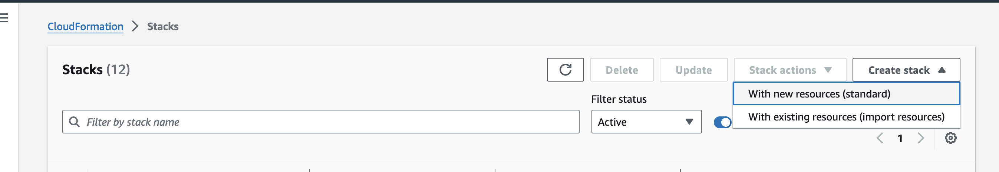
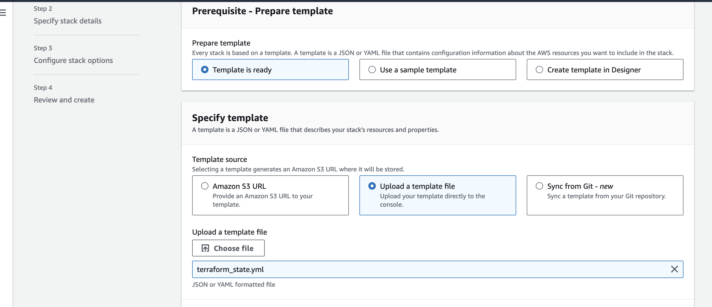
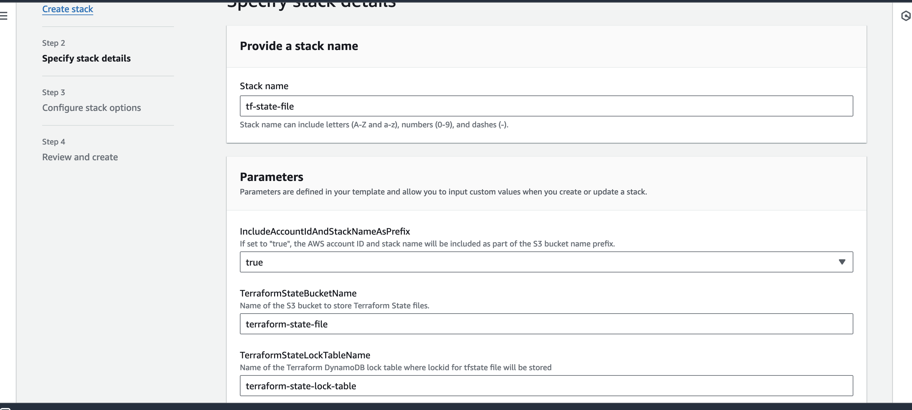
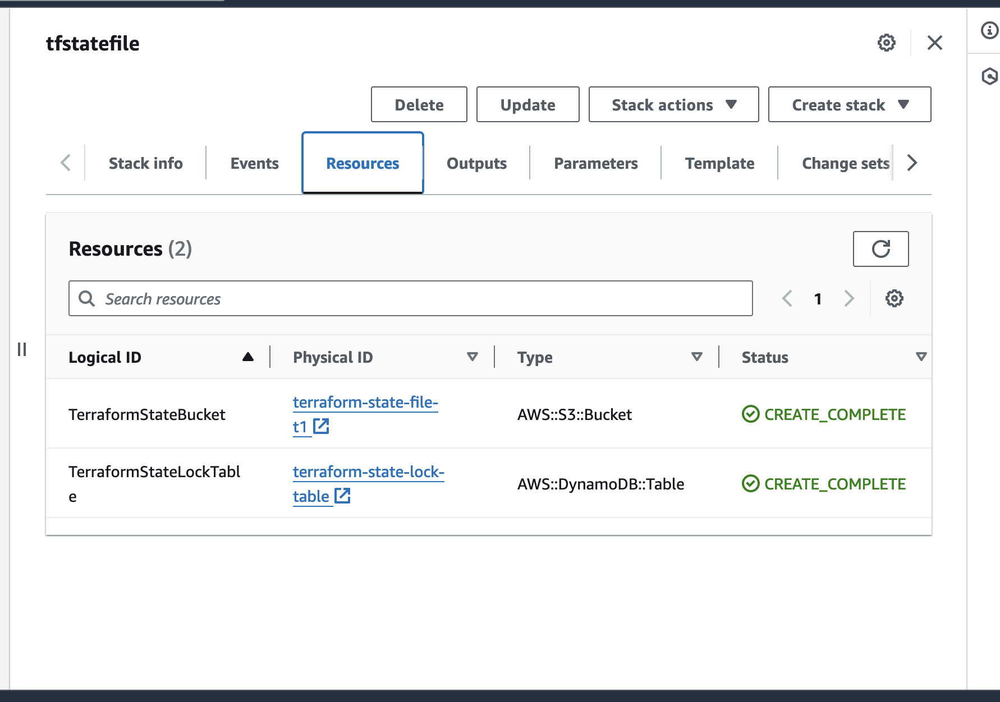

## License
This project is licensed under the Apache License 2.0. You can find the full license text at: [https://www.apache.org/licenses/LICENSE-2.0](https://www.apache.org/licenses/LICENSE-2.0)

# terraform-aws-tfstate-backend using AWS Cloudformation

## Description

This CloudFormation template automates the deployment of Terraform infrastructure, enabling streamlined management of **S3 buckets** and **DynamoDB** tables for storing essential Terraform state files.

This CloudFormation template simplifies **Terraform state management** by automating the deployment of a centralized solution. It utilizes **S3 bucket** for secure storage of your **Terraform state files** and a **DynamoDB table** to implement **locking mechanisms**. This ensures only one Terraform session can modify infrastructure at a time, preventing conflicts and maintaining data consistency. Additionally, the centralized approach fosters **collaboration** and **disaster recovery**, while S3 and DynamoDB offer improved **security** and **scalability** for your infrastructure deployments.

**This template creates the following resources:**

- S3 bucket to store Terraform state files
- DynamoDB table to manage Terraform state file locks

**This template supports the following:**

1. Forced server-side encryption for the S3 bucket
2. S3 bucket versioning to allow for Terraform state recovery in the case of accidental deletions and human errors
3. State locking and consistency checking via DynamoDB table to prevent concurrent operations

'https://developer.hashicorp.com/terraform/language/settings/backends/s3'

## Parameters

- **TerraformStateBucketName**: Name of the S3 bucket to store Terraform state files.
- **IncludeAccountIdAndStackNameAsPrefix**: If set to "true", the AWS account ID and stack name will be included as part of the S3 bucket name prefix.
- **TerraformStateLockTableName**: Name of the Terraform DynamoDB lock table where lock ID for the TFState file will be stored.


## Conditions

- **IncludeAccountIdAndStackNameAsPrefix**: This condition determines whether the AWS account ID and stack name are included as part of the S3 bucket name prefix.

## Resources

### TerraformStateBucket

- **Type**: AWS::S3::Bucket
- **Description**: S3 bucket to store Terraform state files.
- **Properties**:
  - TerraformStateBucketName: Name of the S3 bucket. If "IncludeAccountIdAndStackNameAsPrefix" is enabled, the bucket name will include the AWS account ID and stack name as prefix.

### TerraformStateLockTable

- **Type**: AWS::DynamoDB::Table
- **Description**: DynamoDB table to manage state file locks.
- **Properties**:
  - TerraformStateLockTableName: Name of the DynamoDB table to store terraform state file locks.

## Usage
**Deploy the CloudFormation stack using the AWS Management Console, AWS CLI**

**1.Using AWS Management Console**

1. **Navigate to AWS Management Console:** Open your web browser and go to the [AWS Management Console](https://aws.amazon.com/console/).

2. **Go to CloudFormation:** In the AWS Management Console, search for "CloudFormation" in the services search bar, and click on "CloudFormation" to open the CloudFormation dashboard.

3. **Create Stack:** Click on the "Create stack" button to initiate the process of creating a new CloudFormation stack.


4. **Select Template:** Choose "Upload a template file" and upload the CloudFormation template file (`terraform_state.yml`) you want to use.


5. **Configure Stack:** Provide necessary parameters such as `Stack name`, and provide Parameters `IncludeAccountIdAndStackNameAsPrefix` ,`TerraformStateBucketName` & `TerraformStateLockTableName` if needed or you can use the **default values**.


6. **Review and Create:** Review the stack configuration, and click "Create stack" to initiate the creation process.

7. **Wait for Stack Creation:** AWS will start creating the stack, and you can monitor the progress on the CloudFormation dashboard.

8. **Access Stack Resources:** Once the stack creation is complete, you can access the resources created by navigating to the respective AWS services (S3, DynamoDB, etc.) using the AWS Management Console.


**2. Using the AWS CLI:**
- Prerequisites:
  - Install and configure the AWS CLI on your system. Refer to the official documentation    for  instructions: https://docs.aws.amazon.com/cli/latest/userguide/getting-started-install.html
  - Have access credentials (access key and secret access key) with appropriate permissions to create S3 buckets and DynamoDB tables.
- Command:
  ```
    aws cloudformation deploy \
        --template-file <template-file-path> \
        --stack-name <stack-name> \
        --parameter-overrides \
            ParameterKey=TerraformStateBucketName,ParameterValue=<bucket-name> \
            (Optional)ParameterKey=IncludeAccountIdAndStackNameAsPrefix,ParameterValue=<true/false> \
            ParameterKey=TerraformStateLockTableName,ParameterValue=<table-name>
  ``` 
- Replace the placeholders:

   - {{template-file-path}} : Path to your CloudFormation template file.
   - {{stack-name}} : The desired name for your CloudFormation stack.
   - {{bucket-name}} : The name you want to give to the S3 bucket.
   - {{true/false}} : for IncludeAccountIdAndStackNameAsPrefix (optional).
   - {{table-name}} : The name for the DynamoDB table.
- Run the command: This will deploy the CloudFormation stack based on the provided template and parameters.            

## Note

- Ensure that IAM users or roles deploying this CloudFormation stack have the necessary permissions to create S3 buckets and DynamoDB tables.

